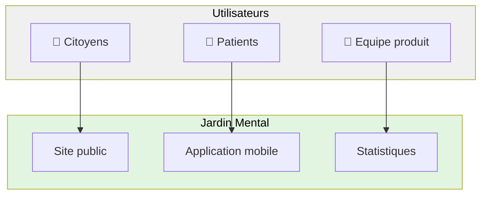
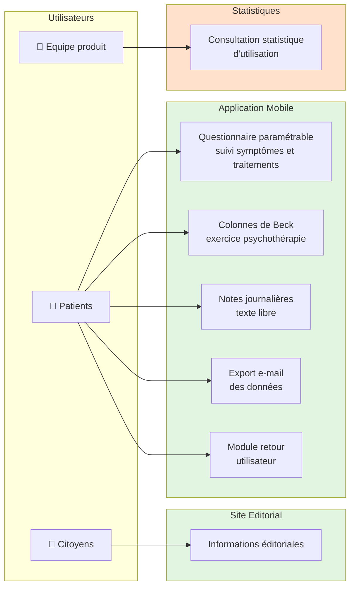
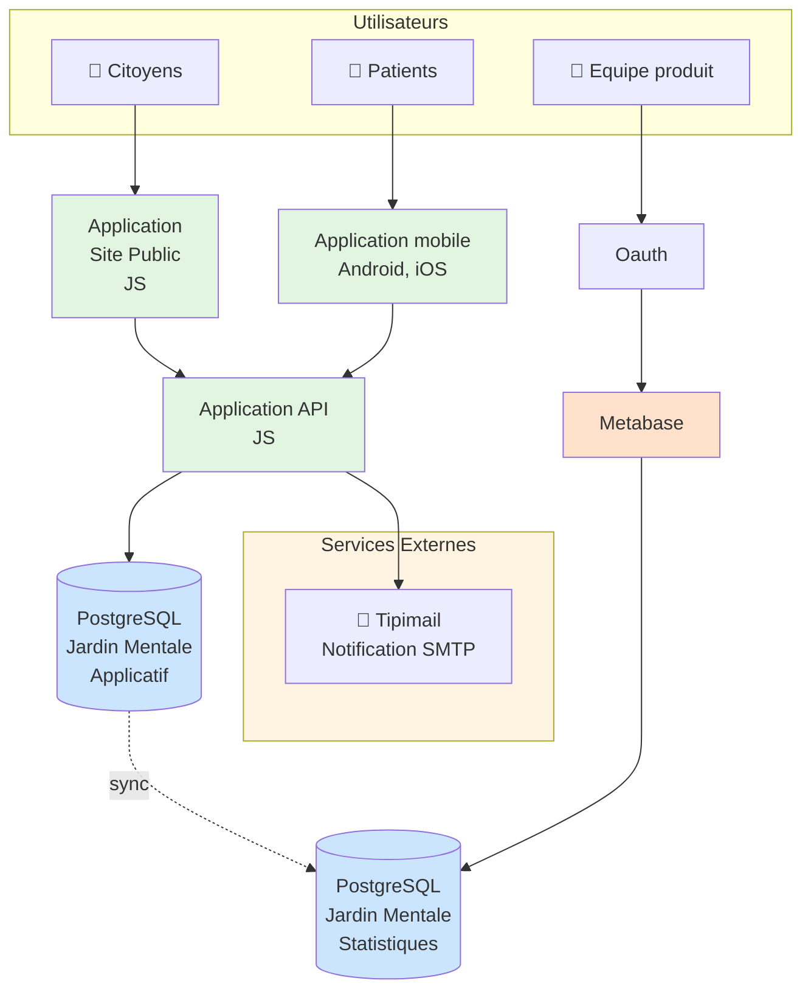
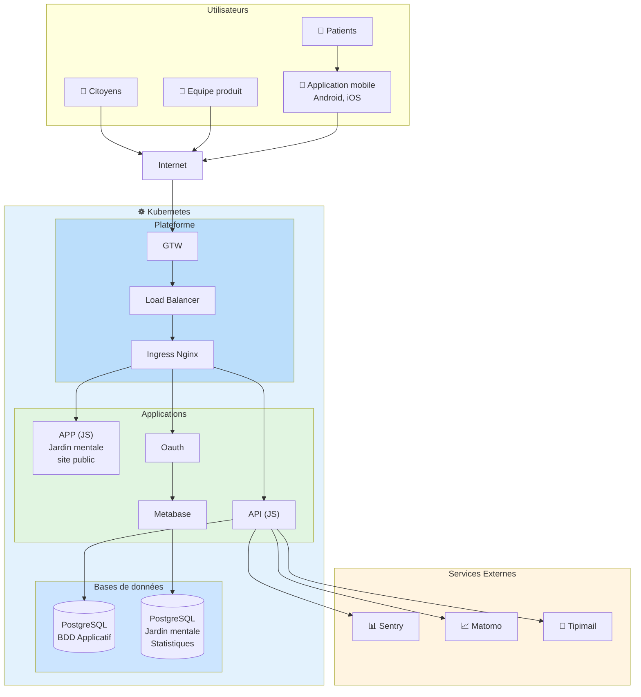

# Jardin Mental - Dossier d'Architecture

## 1. PROJET - ACTEURS

### Nom du projet applicatif

**Jardin Mental**

### Contexte projet applicatif

Les troubles psychiatriques touchent plus de 20 % de la population, à un moment de la vie. Et trouver le bon traitement peut prendre plusieurs années. Pendant ce temps-là, les symptômes évoluent, peuvent devenir chroniques et l'état du patient s'aggrave. L'impact peut être dramatique.

### Objectifs projet applicatif

Le médecin choisit ou modifie un traitement en se basant sur ce que lui rapporte la personne durant la consultation. Mais le médecin n'a que peu de temps avec la personne concernée et les informations rapportées ne sont pas fiables.

Les jeunes que nous avons interrogés rapportent en effet avoir du mal à dire tout ce qu'ils souhaitent en consultation et expliquent repartir en ayant bien souvent omis de transmettre une ou plusieurs informations importantes.

C'est qu'il est très difficile de donner une représentation fiable de ses symptômes et de l'évolution de ceux-ci.

**Pourquoi ?** Car aucun humain n'est capable de se souvenir fidèlement de l'évolution de son état psychique sur une durée trop longue.

Il est par exemple quasiment impossible de se rappeler la qualité de son sommeil 3 semaines auparavant, d'être suffisamment précis sur le nombre de crise d'angoisse survenues le mois dernier, l'intensité de celles-ci et leur impact sur notre quotidien, ou encore de se rappeler de ces jours où ça allait vraiment bien, alors que les jours précédant le rendez-vous, la tristesse nous a envahit...

### Enjeux projet applicatif

Plus les informations concernant mes symptômes sont proches de la réalité, de ce que je vis, plus mon médecin sera en mesure de me prescrire le bon traitement, celui qui sera le plus efficace possible avec le moins d'effets indésirables.

**Jardin Mental, c'est une aide pour un dialogue continu, qui s'adresse à tous, co-construite avec les usagers, comprenant :**

- La possibilité de sélectionner les symptômes et les effets indésirables des traitements médicaux à suivre
- Un rappel quotidien pour m'aider à y penser
- Des écrans simples permettant une saisie rapide
- Une synthèse de l'évolution de l'intensité des symptômes au cours du temps
- Un accès à des données informatives concernant les symptômes suivis
- Un parcours motivationnel dans la participation à mon suivi

Jardin Mental, c'est permettre aux personnes suivies de rester au plus près de leur expérience et d'en rendre compte le plus fidèlement possible au médecin, pour lui permettre de participer à soulager la souffrance grâce à une intervention médicamenteuse adéquate, personnalisée et rapide.

### Planning projet

| Version | Date | Description |
| ------- | ---- | ----------- |
| —       | —    | —           |

### Acteurs Projet

| Rôle                   | Nom               | Entité             |
| ---------------------- | ----------------- | ------------------ |
| Intrapreneur           | —                 | —                  |
| Chargé de portefeuille | REZGUI Lycia      | Fabrique Numérique |
| Product Manager        |                   |                    |
| Partie prenante        | —                 | —                  |
| Designer UX/UI         |                   | —                  |
| Développeur            |                   |                    |
| Développeur            | —                 | —                  |
| Développeur            | —                 | —                  |
| Equipe plateforme      | VAN-WOERKENS Gary | Fabrique Numérique |
| Equipe plateforme      | RENQUIN Igor      | Fabrique Numérique |

### Acteurs métiers du SI applicatif

Identifier les profils d'utilisateurs de l'applicatif, leur provenance et leur nombre

| Profils utilisateurs    | MCAS | RIE, intermin | Externe | Public |
| ----------------------- | ---- | ------------- | ------- | ------ |
| Equipe Produit          | —    | —             | X       | —      |
| Citoyens                | —    | —             | —       | X      |
| Patients                | —    | —             | —       | X      |
| Professionnels de santé | —    | —             | —       | —      |

---

## 2. FONCTIONNALITES – DONNEES

### Fonctionnalités du SI Applicatif

#### Fonctionnalités du SI Applicatif - Site éditorial

| Fonctionnalités          | MCAS | RIE, intermin | Externe | Public |
| ------------------------ | ---- | ------------- | ------- | ------ |
| Informations éditoriales | —    | —             | —       | X      |

#### Fonctionnalités du SI Applicatif - Statistiques

| Fonctionnalités                                                                                                                              | MCAS | RIE, intermin | Externe | Public |
| -------------------------------------------------------------------------------------------------------------------------------------------- | ---- | ------------- | ------- | ------ |
| Analyse de la donnée d'usage de l'application par l'utilisateur (du parcours utilisateur dans l'application, nb connexion, type de terminal) | —    | —             | X       | —      |

#### Fonctionnalités du SI Applicatif - Application Mobile

| Fonctionnalités                                                                                                                               | MCAS | RIE, intermin | Externe | Public |
| --------------------------------------------------------------------------------------------------------------------------------------------- | ---- | ------------- | ------- | ------ |
| Un questionnaire entièrement paramétrable permettant aux usagers de suivre l'ensemble des critères de leurs choix ainsi que leurs traitements | —    | —             | —       | X      |
| Les colonnes de beck : un exercice de psychothérapie                                                                                          | —    | —             | —       | X      |
| Les analyses : un ensemble de vue permettant d'avoir une analyse des données renseignées                                                      | —    | —             | —       | X      |
| Des notes : permettant à l'usagers de renseigner des éléments pour une journée donnée sous forme de texte libre                               | —    | —             | —       | X      |
| L'export de données : sous forme d'e-mail vers un destinataire au choix                                                                       | —    | —             | —       | X      |
| Un module de retour utilisateur                                                                                                               | —    | —             | —       | X      |
| Se fixer et suivre des objectifs à réaliser                                                                                                   | —    | —             | —       | X      |
| Demande sur les consommations, addictions                                                                                                     | —    | —             | —       | X      |

### Données métier du SI Applicatif

| Données métier du SI Applicatif | MCAS | RIE, intermin | Externe | Public |
| ------------------------------- | ---- | ------------- | ------- | ------ |
| —                               | —    | —             | —       | —      |

### Référentiel de données hors SI Applicatif

| Fichiers métier du SI Applicatif | MCAS | RIE, intermin | Externe | Public |
| -------------------------------- | ---- | ------------- | ------- | ------ |
| —                                | —    | —             | —       | —      |

### Sensibilité des données dans le SI Applicatif

#### Sensibilité des données - Site éditoriale

| Type de données très sensible | Présence | Type de données Sensible | Présence | Type de données Public    | Présence |
| ----------------------------- | -------- | ------------------------ | -------- | ------------------------- | -------- |
| NIR                           | —        | Architecture technique   | —        | Editoriaux                | X        |
| Médicales                     | —        | Organisationnel          | —        | Publication extranet      | —        |
| Vie Privée                    | —        | Etat civil               | —        | Campagne de communication | —        |
| Justice                       | —        | Adresse postale          | —        | Statistiques publiables   | X        |
| Identité                      | —        | Vie personnelle          | —        |                           |          |
| Biométrique                   | —        | Vie professionnelle      | —        |                           |          |
| Mécanisme de fraude           | —        | Mouvements salariaux     | —        |                           |          |
| Architecture Sécurisé         | —        | Santé économique         | —        |                           |          |
| Failles & Vulnérabilité       | —        |                          |          |                           |          |
| Patrimoine                    | —        |                          |          |                           |          |
| Appartenance syndicale        | —        |                          |          |                           |          |

#### Sensibilité des données - Statistiques

| Type de données très sensible | Présence | Type de données Sensible | Présence | Type de données Public    | Présence |
| ----------------------------- | -------- | ------------------------ | -------- | ------------------------- | -------- |
| NIR                           | —        | Architecture technique   | —        | Editoriaux                | —        |
| Médicales                     | —        | Organisationnel          | —        | Publication extranet      | —        |
| Vie Privée                    | —        | Etat civil               | —        | Campagne de communication | —        |
| Justice                       | —        | Adresse postale          | —        | Statistiques publiables   | —        |
| Identité                      | —        | Vie personnelle          | —        |                           |          |
| Biométrique                   | —        | Vie professionnelle      | —        |                           |          |
| Mécanisme de fraude           | —        | Mouvements salariaux     | —        |                           |          |
| Architecture Sécurisé         | —        | Santé économique         | —        |                           |          |
| Failles & Vulnérabilité       | —        |                          |          |                           |          |
| Patrimoine                    | —        |                          |          |                           |          |
| Appartenance syndicale        | —        |                          |          |                           |          |

#### Sensibilité des données - Application mobile

| Type de données très sensible | Présence | Type de données Sensible | Présence | Type de données Public    | Présence |
| ----------------------------- | -------- | ------------------------ | -------- | ------------------------- | -------- |
| NIR                           | —        | Architecture technique   | —        | Editoriaux                | —        |
| **Médicales**                 | **X**    | Organisationnel          | —        | Publication extranet      | —        |
| **Vie Privée**                | **X**    | Etat civil               | —        | Campagne de communication | —        |
| Justice                       | —        | Adresse postale          | —        | Statistiques publiables   | —        |
| Identité                      | —        | Vie personnelle          | —        |                           |          |
| Biométrique                   | —        | Vie professionnelle      | —        |                           |          |
| Mécanisme de fraude           | —        | Mouvements salariaux     | —        |                           |          |
| Architecture Sécurisé         | —        | Santé économique         | —        |                           |          |
| Failles & Vulnérabilité       | —        |                          |          |                           |          |
| Patrimoine                    | —        |                          |          |                           |          |
| Appartenance syndicale        | —        |                          |          |                           |          |

### Services utilisés par l'application

| Services utilisés par l'application | Mode d'échange | MCAS | RIE, intermin | Externe | Public |
| ----------------------------------- | -------------- | ---- | ------------- | ------- | ------ |
| TIPIMAIL                            | SMTP           | —    | —             | X       | —      |

---

## 3. CONTRAINTES – VOLUMETRIE

### Contraintes légales

À compléter

### Contraintes métiers

À compléter

### Normes et règles à respecter

| Norme    | Description                                             |
| -------- | ------------------------------------------------------- |
| **RGPD** | Règlement Général sur la Protection des Données         |
| **RGAA** | Référentiel Général d'Accessibilité des Administrations |
| **RGS**  | Référentiel Général de Sécurité                         |
| **RGI**  | Référentiel Général d'Interopérabilité                  |

### Dépendances avec d'autres SI

| Nom du SI Applicatif | Fournisseur | Consommateur |
| -------------------- | ----------- | ------------ |
| —                    | —           | —            |

### Dépendances avec le poste de travail

| Dépendance avec le terminal utilisateur | Composant    |
| --------------------------------------- | ------------ |
| O.S.                                    | Android, iOS |
| Navigateur                              | —            |
| Suite bureautique                       | —            |
| Plugin, Addin                           | —            |
| Périphérique                            | —            |

### Volumétrie données du SI Applicatif

**Note importante :** La majorité des données utilisateur (DiaryData, Indicators, Goals, etc.) sont stockées localement sur le terminal mobile (AsyncStorage), pas sur le serveur. La base de données serveur ne contient que les utilisateurs anonymisés et leurs rappels.

#### Métriques utilisateurs (stores + analytics)

_Données collectées le 09/02/2026 (période : 30 derniers jours)_

| Métrique                                      | Valeur                      | Source                | Notes                                    |
| --------------------------------------------- | --------------------------- | --------------------- | ---------------------------------------- |
| **Installations totales (iOS)**               | **128,000**                 | App Store Connect     | Cumul depuis lancement                   |
| **Installations totales (Android)**           | **37,781**                  | Google Play Console   | Cumul depuis lancement                   |
| **Installations totales (combiné)**           | **165,781**                 | Stores                | iOS + Android                            |
| **Utilisateurs actifs stores (30j)**          | **1,991**                   | Stores                | iOS: 722, Android: 1,269                 |
| **Utilisateurs actifs mensuels (MAU)**        | **4,192**                   | Matomo                | Visiteurs uniques 30 derniers jours      |
| **Utilisateurs actifs quotidiens (DAU)**      | **1,455**                   | Matomo                | Moyenne journalière récente              |
| **Ratio DAU/MAU**                             | **34.7%**                   | Calculé               | Très bon taux d'engagement               |
| **Sessions par mois**                         | **~14,507**                 | Matomo                | ~484 sessions/jour                       |
| **Événements trackés par mois**               | **277,212**                 | Matomo                | ~9,240 événements/jour                   |
| **Actions par session**                       | **19.1**                    | Matomo                | Engagement élevé                         |
| **Durée moyenne session**                     | **3 min 59s**               | Matomo                | Indicateur d'engagement                  |
| **Taux de rétention J+7**                     | Non disponible              | Stores / Matomo       | Non accessible dans interfaces stores    |
| **Taux de rétention J+30**                    | Non disponible              | Stores / Matomo       | Non accessible dans interfaces stores    |
| **Croissance mensuelle (nouveaux utilisateurs)** | **~2,637**               | Stores                | iOS: 775/mois, Android: 1,862/mois       |

#### Volumétrie Base de données PostgreSQL (serveur)

_Données collectées le 09/02/2026 via requêtes SQL directes sur la base de production._

| ID  | Description                                          | Valeur                    | Calcul/Source                      |
| --- | ---------------------------------------------------- | ------------------------- | ---------------------------------- |
| D1  | Nombre d'utilisateurs actuels (AnonymisedUser)       | **55,145**                | Query: `SELECT COUNT(*) FROM "AnonymisedUser"` |
| D2  | Nombre de rappels actuels (Reminder)                 | **276,012**               | Query: `SELECT COUNT(*) FROM "Reminder"` |
| D3  | Taille actuelle de la base de données (Mo)           | **188 MB**                | PostgreSQL: `pg_database_size`     |
| D4  | Nombre de nouveaux utilisateurs par mois (moyenne)   | **~2,637**                | Estimé depuis stores (iOS + Android) |
| D5  | Nombre de nouveaux rappels par mois (moyenne)        | **~13,185**               | D4 × (D2/D1) = 2,637 × 5           |
| D6  | Taille moyenne par utilisateur (Ko)                  | **~3.4 KB**               | D3 / D1 = 188 MB / 55,145          |
| D7  | Croissance mensuelle de la BDD (Mo/mois)             | **~9 MB/mois**            | D4 × D6 = 2,637 × 3.4 KB           |
| D8  | Volume BDD projeté à 1 an (Mo)                       | **~296 MB** (0.29 GB)     | D3 + (D7 × 12) = 188 + 108         |
| D9  | Volume BDD projeté à 3 ans (Mo)                      | **~511 MB** (0.50 GB)     | D3 + (D7 × 36) = 188 + 323         |

**Observations PostgreSQL :**
- **Base très légère** : 188 MB pour 55K utilisateurs = architecture efficace
- **~5 rappels/utilisateur** : bonne adoption de la fonctionnalité notifications
- **33% conversion** : 55K users en base vs 165K installations (normale pour apps santé)
- **Scalabilité excellente** : croissance de ~9 MB/mois, aucun problème prévu

### Volumétrie fichiers du SI Applicatif

**Note :** L'application ne stocke pas de fichiers côté serveur. Les images, PDF et autres contenus statiques sont :
- Soit embarqués dans l'application mobile (assets)
- Soit hébergés via CDN externe
- Les données utilisateur sont en AsyncStorage (appareil mobile)

#### Volumétrie logs et monitoring

_Note : Données techniques non collectées. Nécessite accès Kubernetes, Sentry admin et Matomo admin._

| ID  | Description                                    | Valeur            | Source/Calcul                    |
| --- | ---------------------------------------------- | ----------------- | -------------------------------- |
| L1  | Volume de logs applicatifs par jour (Mo)       | [À COLLECTER]     | Kubernetes logs                  |
| L2  | Volume de logs Sentry par mois (événements)    | [À COLLECTER]     | Sentry dashboard                 |
| L3  | Volume de données Matomo par mois (Mo)         | [À COLLECTER]     | Matomo admin                     |
| L4  | Rétention des logs (jours)                     | [À COLLECTER]     | Configuration infrastructure     |
| L5  | Volume total logs mensuel (Go)                 | [À CALCULER]      | (L1 × 30) / 1024                 |

#### Analyse et insights volumétrie

**Répartition des installations (stores) :**
- **iOS domine** avec 77% des installations totales (128K vs 37.8K Android)
- **Android plus dynamique** en croissance récente : ~2,010 nouveaux/mois vs 775 sur iOS
- **Utilisateurs actifs** : 1,991 sur stores (30 jours) vs 4,192 MAU Matomo
  - Écart expliqué par : définitions différentes entre stores et analytics, multi-appareils

**Engagement utilisateur (Matomo) :**
- **Excellent taux d'engagement** : 34.7% DAU/MAU (industrie moyenne ~20%)
  - Suggère que ~73% des utilisateurs ouvrent l'app quotidiennement
- **19.1 actions/session** : très élevé, indique une utilisation intensive
- **3m59s/session** : durée cohérente avec usage de saisie de données santé mentale
- **~484 sessions/jour** : usage quotidien régulier et distribué

**Croissance et projections :**
- **Croissance mensuelle combinée** : ~2,785 nouveaux utilisateurs/mois
- **Tendance** : Accélération sur Android, stabilisation sur iOS (marché mature)
- **Base utilisateurs actifs stable** : ~2,000 utilisateurs quotidiens
- **Rétention** : Non mesurable directement, mais excellent DAU/MAU suggère forte rétention

**Implications techniques :**
- **Charge serveur limitée** : données stockées côté client (AsyncStorage)
- **Backend léger** : uniquement AnonymisedUser + Reminders en PostgreSQL (188 MB)
- **Scalabilité excellente** :
  - Base actuelle : 188 MB pour 55K users
  - Croissance : ~9 MB/mois
  - Projection 3 ans : ~511 MB (< 1 GB)
  - Aucune refonte nécessaire
- **Conversion 33%** : 55K users en base vs 165K installations (normale pour apps santé)
- **Monitoring robuste** : 277K événements Matomo/mois = visibilité complète usage

### Réduction volume de données

#### Stratégie de gestion du volume

**Base de données PostgreSQL :**
- **Utilisateurs inactifs** : [Définir politique] - ex: suppression après 24 mois d'inactivité
- **Rappels orphelins** : Nettoyage automatique si utilisateur supprimé (cascade)
- **Tokens expirés** : Nettoyage des tokens de notification invalides (détectés lors de l'envoi)

**Logs et monitoring :**
- **Logs Kubernetes** : Rétention à définir (recommandé : 30-90 jours)
- **Logs Sentry** : Rétention selon plan souscrit
- **Analytics Matomo** : Pas de limite, données anonymisées et agrégées

**Données utilisateur (mobile) :**
- Aucune purge serveur (données stockées localement sur l'appareil)
- L'utilisateur contrôle ses données via l'application
- Export possible avant suppression de l'app

**Backups :**
- Backups PostgreSQL : [Définir rétention] - ex: quotidiens gardés 30j, hebdomadaires 3 mois
- Restauration possible sur période définie

---

## 4. EXIGENCES NON FONCTIONNELLES

### Exigences sur les données

| Exigence                    | Objectif, Score visé | Moyens à mettre en œuvre                                |
| --------------------------- | -------------------- | ------------------------------------------------------- |
| Exigence de Disponibilité   | —                    | —                                                       |
| Exigence d'Intégrité        | —                    | Contrôles d'intégrité sur les données sensibles         |
| Exigence de Confidentialité | —                    | Données médicales et privées protégées, accès restreint |
| Exigence de Traçabilité     | —                    | Monitoring via Sentry, logs applicatifs                 |

| Information                            | Valeur       |
| -------------------------------------- | ------------ |
| Liens vers étude AIPD                  | —            |
| Lins vers analyse de Risque (EBIOS RM) | —            |
| AQSSI                                  | À renseigner |
| Responsable de traitement              | À renseigner |
| Homologué RGS                          | À renseigner |
| Date d'homologation                    | À renseigner |
| Durée d'homologation                   | À renseigner |
| Lien vers le dossier d'homologation    | À renseigner |

### Période de service, Garantie de service, Performance

#### Site Jardin mental site éditorial

**Période de service**

| Période  | Date début | Date fin | NBC | NBS |
| -------- | ---------- | -------- | --- | --- |
| Standard | Lundi      | dimanche | —   | —   |
| Critique | —          | —        | —   | —   |
| Charge   | —          | —        | —   | —   |

Description de la charge : —

**Garantie de service**

| Application métier                       | Application | Standard |
| ---------------------------------------- | ----------- | -------- |
| Plage de Services Infogérance            | —           | —        |
| Perte de Données maximale Admissible     | 48h         | —        |
| Durée Maximale d'Interruption Admissible | 48h         | —        |

| Impact                                         | Description                                                                                                                       |
| ---------------------------------------------- | --------------------------------------------------------------------------------------------------------------------------------- |
| Impact Métier en cas de perte de données       | **Faible :** les stores applicatifs (google et apple) publient les mêmes info que le site éditorial                               |
| Impact Métier en cas de défaillance du service | **Faible :** Perte de visibilité sur l'accès à l'application mobile et les informations générales proposées par le site éditorial |

**Performance**

| Temps de réponse            | Période Standard | Période de charge |
| --------------------------- | ---------------- | ----------------- |
| Affichage Page d'accueil    | —                | —                 |
| Affichage page simple       | —                | —                 |
| Affichage page complexe     | —                | —                 |
| Traitement requête simple   | —                | —                 |
| Traitement requête complexe | —                | —                 |

**Exploitabilité**

| Batch applicatif | Plage d'exécution | Fréquence | Impact métier | Impact charge |
| ---------------- | ----------------- | --------- | ------------- | ------------- |
| N/A              | —                 | —         | N/A           | N/A           |

#### Site Jardin mental Applicatif

**Période de service**

| Période  | Date début | Date fin | NBC | NBS |
| -------- | ---------- | -------- | --- | --- |
| Standard | —          | —        | —   | —   |
| Critique | —          | —        | —   | —   |
| Charge   | —          | —        | —   | —   |

Description de la charge : —

**Garantie de service**

| Application métier                       | Application | Standard |
| ---------------------------------------- | ----------- | -------- |
| Plage de Services Infogérance            | —           | —        |
| Perte de Données maximale Admissible     | —           | —        |
| Durée Maximale d'Interruption Admissible | —           | —        |

| Impact                                         | Description |
| ---------------------------------------------- | ----------- |
| Impact Métier en cas de perte de données       | —           |
| Impact Métier en cas de défaillance du service | —           |

**Performance**

| Temps de réponse            | Période Standard | Période de charge |
| --------------------------- | ---------------- | ----------------- |
| Affichage Page d'accueil    | —                | —                 |
| Affichage page simple       | —                | —                 |
| Affichage page complexe     | —                | —                 |
| Traitement requête simple   | —                | —                 |
| Traitement requête complexe | —                | —                 |

**Exploitabilité**

| Batch applicatif | Plage d'exécution | Fréquence | Impact métier | Impact charge |
| ---------------- | ----------------- | --------- | ------------- | ------------- |
| —                | —                 | —         | —             | —             |

#### Site Jardin mental Statistiques

**Période de service**

| Période  | Date début | Date fin | NBC | NBS |
| -------- | ---------- | -------- | --- | --- |
| Standard | Lundi      | Vendredi | 5   | —   |
| Critique | —          | —        | —   | —   |
| Charge   | —          | —        | —   | —   |

Description de la charge : —

**Garantie de service**

| Application métier                       | Application | Standard |
| ---------------------------------------- | ----------- | -------- |
| Plage de Services Infogérance            | —           | —        |
| Perte de Données maximale Admissible     | 48h         | —        |
| Durée Maximale d'Interruption Admissible | 48h         | —        |

| Impact                                         | Description                                                                  |
| ---------------------------------------------- | ---------------------------------------------------------------------------- |
| Impact Métier en cas de perte de données       | **Faible :** Les statistiques d'usages se calculent sur des périodes longues |
| Impact Métier en cas de défaillance du service | **Faible :** Les statistiques d'usages se calculent sur des périodes longues |

**Performance**

| Temps de réponse            | Période Standard | Période de charge |
| --------------------------- | ---------------- | ----------------- |
| Affichage Page d'accueil    | —                | —                 |
| Affichage page simple       | —                | —                 |
| Affichage page complexe     | —                | —                 |
| Traitement requête simple   | —                | —                 |
| Traitement requête complexe | —                | —                 |

**Exploitabilité**

| Batch applicatif | Plage d'exécution | Fréquence | Impact métier | Impact charge |
| ---------------- | ----------------- | --------- | ------------- | ------------- |
| —                | —                 | —         | —             | —             |

---

## 5. ARCHITECTURE ACTEURS ET PROCESSUS

```
                  ┌─────────────┐              ┌─────────────┐
                  │   Citoyens  │              │   Patients  │
                  │     👥      │              │     👥      │
                  └──────┬──────┘              └──────┬──────┘
                         │                            │
                         └────────────┬───────────────┘
                                      │
                 ┌────────────────────┴────────────────────────┐
                 │          Jardin Mental                      │
                 │                                             │
                 │  ┌──────────────┐    ┌──────────────┐      │
                 │  │              │    │              │      │
                 │  │ Site public  │    │ Application  │      │
                 │  │              │    │   mobile     │      │
                 │  └──────────────┘    └──────────────┘      │
                 │                                             │
                 │                      ┌──────────────┐      │
                 │                      │              │      │
                 │                      │ Statistiques │◄─────┼──── 👥 Equipe produit
                 │                      │              │      │
                 │                      └──────────────┘      │
                 │                                             │
                 └─────────────────────────────────────────────┘
```

**Version Mermaid :**



---

## 6. ARCHITECTURE FONCTIONNELLE

```
                     👥                                  👥
                  Patients                            Citoyens
                     │                                    │
                     ▼                                    ▼
        ┌────────────────────────────┐     ┌────────────────────────────┐
        │   Application Mobile       │     │  Jardin Mental - Site      │
        │                            │     │      Editorial             │
        ├────────────────────────────┤     ├────────────────────────────┤
        │ Un questionnaire entière-  │     │                            │
        │ ment paramétrable permet-  │     │  Informations éditoriales  │
        │ tant aux usagers de suivre │     │                            │
        │ l'ensemble des critères de │     └────────────────────────────┘
        │ leurs choix ainsi que      │                  │
        │ leurs traitements          │                  │
        ├────────────────────────────┤                  │
        │ Les colonnes de beck :     │                  ▼
        │ un exercice de thérapie    │     ┌────────────────────────────┐
        │ psychothérapie             │     │      Statistiques          │
        ├────────────────────────────┤     │                            │
        │ Des notes : permettant à   │     │  Consultation statistique  │
        │ l'usagers de renseigner    │     │  d'utilisation de          │
        │ des éléments pour une      │     │  l'application             │
        │ journée donnée sous forme  │     │                            │
        │ de texte libre             │     └─────────────┬──────────────┘
        ├────────────────────────────┤                   │
        │ Envoi par e-mail des       │                   │
        │ données renseignées vers   │                   ▼
        │ un destinataire             │              👥
        ├────────────────────────────┤           Equipe produit
        │ Un module de retour        │
        │ utilisateur                │
        └────────────────────────────┘
```

**Version Mermaid :**



---

## 7. ARCHITECTURE APPLICATIVE

```
          👥                            👥                      👥
       Citoyens                     Patients              Equipe produit
          │                            │                        │
          │                            │                        │
          ▼                            ▼                        ▼
   ┌─────────────┐            ┌─────────────────┐      ┌─────────────┐
   │             │            │  Application    │      │             │
   │ Application │            │    mobile       │      │    Oauth    │
   │             │            │  Android, iOS   │      │             │
   │   (JS)      │            │                 │      └──────┬──────┘
   │             │            └────────┬────────┘             │
   └──────┬──────┘                     │                      │
          │                            │                      │
          │      ┌─────────────────────┼──────────────────────┘
          │      │                     │
          │      │                     ▼
          │      │            ┌──────────────────┐
          │      │            │  Application API │
          │      │            │                  │
          │      │            │       (JS)       │
          │      │            │                  │
          │      │            └────────┬─────────┘
          │      │                     │
          │      │                     │
          │      │                     ▼
          │      │            ┌──────────────────┐
          │      │            │  PostgreSQL      │
  ┌───────▼──────▼─────┐      │                  │      ┌─────────────┐
  │                    │      │  Jardin Mentale  │      │             │
  │ Notification SMTP  │◄─────┤  - Applicatif    │─────►│  Metabase   │
  │   (Tipimail)       │      │                  │      │             │
  └────────────────────┘      └────────┬─────────┘      └──────▲──────┘
                                       │                        │
                                       │                        │
                                       ▼                        │
                              ┌──────────────────┐              │
                              │   PostgreSQL     │              │
                              │                  │              │
                              │  Jardin Mentale  ├──────────────┘
                              │  - Statistiques  │
                              │                  │
                              └──────────────────┘
```

**Version Mermaid :**



---

## 8. ARCHITECTURE TECHNIQUE

```
                      📱
                 Application mobile
                  Android, iOS          ───────────────►  📊 Sentry
                       │
      👥          👥   │       👥
   Citoyens   Patients │   Equipe produit              ──►  📈 Matomo
       │          │    │       │
       └──────────┼────┴───────┘
                  │                                     ──►  📧 Tipimail
                  │
                  ▼
         ┌────────────────┐
         │   Internet     │
         └────────┬───────┘
                  │
    ┌─────────────┴────────────────────────────────────────────────┐
    │  ☸                                                            │
    │  Kubernetes                                                   │
    │  ┌────────────────────────────────────────────────────────┐  │
    │  │  Plateforme                                            │  │
    │  │                                                         │  │
    │  │   ┌──────┐      ┌────┐      ┌──────────────┐          │  │
    │  │   │ GTW  │─────►│ LB │─────►│ Ingress Nginx│          │  │
    │  │   └──────┘      └────┘      └──────┬───────┘          │  │
    │  │                                     │                  │  │
    │  └─────────────────────────────────────┼──────────────────┘  │
    │                                        │                     │
    │   ┌────────────────────────────────────┼──────────────────┐  │
    │   │                                    ▼                  │  │
    │   │  ┌──────────┐   ┌──────────┐   ┌──────────┐         │  │
    │   │  │          │   │          │   │          │         │  │
    │   │  │   APP    │   │   API    │   │  Oauth   │         │  │
    │   │  │   (JS)   │   │   (JS)   │   │          │         │  │
    │   │  │          │   │          │   └────┬─────┘         │  │
    │   │  │          │   └────┬─────┘        │               │  │
    │   │  │Jardin    │        │              │               │  │
    │   │  │mentale   │        │              ▼               │  │
    │   │  │site      │        │       ┌──────────────┐       │  │
    │   │  │public    │        │       │              │       │  │
    │   │  │          │        │       │   Metabase   │       │  │
    │   │  └──────────┘        │       │              │       │  │
    │   │                      │       └──────┬───────┘       │  │
    │   │                      ▼              │               │  │
    │   │              ┌────────────┐         │               │  │
    │   │              │            │         │               │  │
    │   │              │  BDD       │◄────────┘               │  │
    │   │              │ PostgreSQL │                         │  │
    │   │              │            │                         │  │
    │   │              │Jardin      │                         │  │
    │   │              │mentale     │                         │  │
    │   │              │Statistiques│                         │  │
    │   │              └────────────┘                         │  │
    │   │                                                     │  │
    │   └─────────────────────────────────────────────────────┘  │
    │                                                             │
    └─────────────────────────────────────────────────────────────┘
```

**Légende des flux :**

1. APP (Site public)
2. API accès
3. API ↔ BDD
4. Oauth Proxy accès
5. Oauth ↔ Metabase
6. Metabase ↔ BDD
7. API → Tipimail (SMTP)
8. API → Matomo

**Version Mermaid :**



---

## 9. ARCHITECTURE DE DONNEES

### Modèle de données principal

La base de données PostgreSQL utilise Prisma ORM avec les modèles principaux suivants :

#### AnonymisedUser

- Utilisateur anonymisé
- Identifié par un UUID
- Token de notification unique

#### Reminder

- Rappel associé à un utilisateur
- Types : Main, Goal, Inactivity
- Gestion fine des jours et heures

#### ReminderUtcDaysOfWeek

- Détail des jours de la semaine pour chaque rappel
- Booléens pour chaque jour

**Relations :**

- Un utilisateur possède plusieurs rappels
- Chaque rappel peut avoir une configuration de jours spécifique

**Index :**

- Index sur les tokens (Hash)
- Index sur les types (Hash)
- Index sur les heures (BTree pour optimiser les requêtes de rappels)
- Index sur chaque jour de la semaine (Hash)

### Stockage côté client (AsyncStorage)

**Important :** Les données de santé mentale de l'utilisateur sont stockées exclusivement sur le terminal mobile en local (AsyncStorage), jamais sur le serveur. Cela garantit une confidentialité maximale et l'autonomie de l'utilisateur sur ses données.

#### Entités stockées localement

**DiaryData**
- Données de suivi quotidien (symptômes, traitements, notes)
- Structure : date, indicateurs, valeurs, notes libres
- Export possible par email

**Indicator**
- Indicateurs personnalisés créés par l'utilisateur
- Types : boolean, smiley, slider, custom
- Catégories : symptômes, effets indésirables, habitudes de vie
- Ordre d'affichage personnalisable

**Goal**
- Objectifs fixés par l'utilisateur
- Suivi de réalisation quotidienne
- Statistiques de progression

**Beck (Colonnes de Beck)**
- Exercice de psychothérapie cognitive
- Listes personnalisées : lieux, personnes, émotions, sensations
- Historique des exercices

**Drug (Traitements)**
- Médicaments et posologie
- Historique de prise
- Effets observés

**Notes**
- Notes journalières en texte libre
- Associées à une date

**Configuration utilisateur**
- Préférences d'affichage
- Paramètres de rappels locaux
- Historique de complétion

---

## 9.1. ARCHITECTURE APPLICATION MOBILE

### Vue d'ensemble

L'application mobile Jardin Mental est une application React Native cross-platform (iOS et Android) développée avec Expo. Elle fonctionne de manière autonome avec stockage local des données de santé.

**Caractéristiques principales :**
- **Version actuelle** : 1.40.3 (build 199)
- **Plateformes** : iOS (bundleIdentifier: org.reactjs.native.example.monsuivipsy), Android (package: com.monsuivipsy)
- **Taille du projet** : ~349 fichiers source (TS/TSX/JS)
- **30 scènes principales** organisées par fonctionnalité

### Stack technique

**Framework et Runtime**
- **React Native** : 0.79.7
- **React** : 19.0.0
- **Expo SDK** : 53.0.0
- **TypeScript** : 5.8.3
- **Node.js** : Requis pour le développement

**UI et Styling**
- **NativeWind** : 2.0.11 (TailwindCSS pour React Native)
- **React Native Paper** : 4.12.5 (Material Design)
- **React Native SVG** : 15.14.0
- **Lottie** : 7.2.5 (animations)
- **React Native Reanimated** : 3.17.4 (animations performantes)

**Navigation**
- **React Navigation** : 6.1.18
  - Stack Navigator (navigation principale)
  - Material Top Tabs (onglets)

**State Management**
- **React Context API** (state global)
- **AsyncStorage** : 2.1.2 (stockage local persistant)
- **React Hooks** (state local)

**Data Visualization**
- **React Native Gifted Charts** : 1.4.64 (graphiques)
- **React Native Pie Chart** : 4.0.1 (graphiques circulaires)

**Fonctionnalités natives**
- **Expo Notifications** : 0.31.4 (notifications push)
- **Expo Contacts** : 14.2.5 (accès aux contacts)
- **Expo File System** : 18.1.11 (gestion fichiers)
- **Expo Device** : 7.1.4 (info appareil)
- **React Native Device Info** : 8.3.1
- **Expo Updates** : 0.28.17 (OTA updates)

**Utilitaires**
- **date-fns** : 2.16.1 (manipulation de dates)
- **dayjs** : 1.11.3 (dates)
- **crypto-js** : 4.2.0 (chiffrement)
- **react-native-uuid** : 2.0.3 (génération UUID)
- **lodash** : 4.17.21 (utilitaires JS)
- **zod** : 3.25.63 (validation de schémas)

**Monitoring et Analytics**
- **Sentry** : 6.14.0 (crash reporting)
- **Matomo** : via service personnalisé (analytics anonymisées)

**Tests**
- **Jest** : 29.4.0
- **React Testing Library** : 13.2.0
- **Testing Library Jest Native** : 5.4.3

### Architecture des scènes

**30 scènes principales organisées par domaine :**

1. **Onboarding** (`onboarding-v2/`) : Parcours d'accueil et personnalisation
2. **Survey** (`survey-v2/`, `survey/`) : Questionnaires quotidiens
3. **Status** (`status/`) : Tableau de bord et historique
4. **Suivi** (`suivi/`) : Analyses, corrélations, déclencheurs
5. **Indicateurs** (`indicateurs/`) : Gestion des indicateurs personnalisés
6. **Goals** (`goals/`) : Objectifs et suivi
7. **Beck** (`beck/`, `exercise/`) : Colonnes de Beck et exercices
8. **Crisis Plan** (`crisis-plan/`) : Plan de crise personnalisé
9. **Tools** (`tools/`) : Outils et ressources
10. **Resources** (`resources/`) : Contenu éducatif
11. **Export** (`export/`) : Export des données par email
12. **Settings** (`settings/`) : Paramètres de l'application
13. **Reminder** (`reminder/`) : Gestion des rappels
14. **News** (`news/`) : Actualités et nouveautés
15. **Legal** (`legal/`) : CGU, confidentialité, mentions légales
16. **FAQ** (`faq/`) : Questions fréquentes
17. **Support** (`support/`) : Support utilisateur
18. **Drugs** (`drugs/`) : Gestion des traitements
19. **Diary** (`diary/`) : Journal et notes
20. **Data Export/Import** (`data-export-import/`) : Gestion des données
21. **Dev Mode** (`dev-mode/`) : Mode développeur
22. Et autres...

### Flux de données

```
┌─────────────────────────────────────────────────────────────┐
│                    Application Mobile                        │
│                                                               │
│  ┌───────────────┐        ┌──────────────┐                  │
│  │  React Views  │◄──────►│   Context    │                  │
│  │   (Scenes)    │        │     API      │                  │
│  └───────┬───────┘        └──────┬───────┘                  │
│          │                       │                           │
│          │                       │                           │
│          ▼                       ▼                           │
│  ┌────────────────────────────────────┐                     │
│  │         AsyncStorage               │                     │
│  │  (Stockage local des données)      │                     │
│  │                                    │                     │
│  │  • DiaryData                       │                     │
│  │  • Indicators                      │                     │
│  │  • Goals                           │                     │
│  │  • Beck exercises                  │                     │
│  │  • Configuration                   │                     │
│  └────────────────────────────────────┘                     │
│                                                               │
└────────────┬──────────────────────────────────┬─────────────┘
             │                                  │
             │ (API REST)                       │ (Push)
             ▼                                  ▼
    ┌─────────────────┐              ┌──────────────────┐
    │   Backend API   │              │ Expo Push        │
    │  (Reminders,    │              │ Notifications    │
    │   Version check)│              │                  │
    └─────────────────┘              └──────────────────┘
```

### Sécurité

**Chiffrement**
- Chiffrement des notifications push sensibles (crypto-js)
- HMAC pour validation de l'intégrité des données

**Confidentialité**
- Aucune donnée de santé stockée sur le serveur
- Anonymisation : pas d'identifiant personnel, uniquement UUID
- Données stockées exclusivement en local (AsyncStorage)

**Permissions**
- Notifications (NOTIFICATIONS, POST_NOTIFICATIONS, SCHEDULE_EXACT_ALARM)
- Contacts (READ_CONTACTS) - uniquement pour le plan de crise
- Stockage (READ_EXTERNAL_STORAGE)

### Build et déploiement

**EAS (Expo Application Services)**
- Project ID : 6567f752-92f9-4452-9841-71f6dd09842f
- Owner : fabnum
- Build profiles : production, development

**Plateformes**
- **iOS** : Build number 407, App Store
- **Android** : Version code 389, Google Play Store

**Over-The-Air Updates**
- Expo Updates pour déploiements rapides
- Fallback cache timeout : 10s
- Policy : appVersion

**Build local possible**
- `pnpm build-local:ios`
- `pnpm build-local:android`

---

## 10. SERVEURS, COMPOSANTS APPLICATIFS

### [Site éditorial - APP]

| Attribut         | Valeur    |
| ---------------- | --------- |
| **Rôle**         | APP       |
| **Type**         | Conteneur |
| **CPU Requests** | 100m cpu  |
| **CPU Limits**   | 200m cpu  |
| **RAM Requests** | 256 Mo    |
| **RAM Limits**   | 384 Mo    |
| **HPA Status**   | OFF       |
| **HPA min**      | 2         |
| **HPA max**      | 2         |

**Composants :**

| Catégorie | Composant | Version | Rôle |
| --------- | --------- | ------- | ---- |
| APP       | NodeJS    | —       | —    |

### [Jardin Mentale - Base de données]

| Attribut         | Valeur          |
| ---------------- | --------------- |
| **Rôle**         | Base de données |
| **Type**         | Conteneur       |
| **CPU Requests** | 100m cpu        |
| **CPU Limits**   | 1 cpu           |
| **RAM Requests** | 1 Go            |
| **RAM Limits**   | 1 Go            |
| **HPA Status**   | OFF             |
| **HPA min**      | 3               |
| **HPA max**      | 3               |

**Composants :**

| Catégorie | Composant  | Version | Rôle |
| --------- | ---------- | ------- | ---- |
| CNPG      | PostgreSQL | 15      | —    |

### [Jardin mentale - APP]

| Attribut         | Valeur    |
| ---------------- | --------- |
| **Rôle**         | APP       |
| **Type**         | Conteneur |
| **CPU Requests** | 100m cpu  |
| **CPU Limits**   | 200m cpu  |
| **RAM Requests** | 512 Mo    |
| **RAM Limits**   | 768 Mo    |
| **HPA Status**   | OFF       |
| **HPA min**      | 2         |
| **HPA max**      | 2         |

**Composants :**

| Catégorie | Composant  | Version | Rôle                              |
| --------- | ---------- | ------- | --------------------------------- |
| Runtime   | NodeJS     | >= 14   | Environnement d'exécution         |
| Framework | Express.js | 4.18.2  | Framework web                     |
| Language  | TypeScript | 5.8.3   | Langage de programmation          |
| ORM       | Prisma     | 4.4.0   | ORM pour PostgreSQL               |
| Monitoring| Sentry     | 7.120.3 | Monitoring et gestion des erreurs |

### [Jardin mentale - statistiques - Metabase]

| Attribut       | Valeur      |
| -------------- | ----------- |
| **Rôle**       | Statistique |
| **Type**       | Conteneur   |
| **HPA Status** | OFF         |
| **HPA min**    | 1           |
| **HPA max**    | 1           |

**Composants :**

| Catégorie   | Composant | Version | Rôle |
| ----------- | --------- | ------- | ---- |
| Statistique | Metabase  | —       | —    |

### [Jardin mentale - Oauth]

| Attribut       | Valeur           |
| -------------- | ---------------- |
| **Rôle**       | Authentification |
| **Type**       | conteneur        |
| **HPA Status** | OFF              |
| **HPA min**    | 1                |
| **HPA max**    | 1                |

**Composants :**

| Catégorie | Composant   | Version | Rôle |
| --------- | ----------- | ------- | ---- |
| APP       | oauth proxy | —       | —    |

### [Jardin mentale - statistiques - BDD]

| Attribut         | Valeur          |
| ---------------- | --------------- |
| **Rôle**         | Base de données |
| **Type**         | Conteneur       |
| **CPU Requests** | 256m cpu        |
| **CPU Limits**   | 512m cpu        |
| **RAM Requests** | 1 Go            |
| **RAM Limits**   | 1 Go            |
| **HPA Status**   | OFF             |
| **HPA min**      | 3               |
| **HPA max**      | 3               |

**Composants :**

| Catégorie | Composant  | Version | Rôle |
| --------- | ---------- | ------- | ---- |
| CNPG      | PostgreSQL | 15      | —    |

### [Jardin mentale - statistiques - BSS Sync]

| Attribut         | Valeur                          |
| ---------------- | ------------------------------- |
| **Rôle**         | Base de données Synchronisation |
| **Type**         | Conteneur                       |
| **CPU Requests** | 100m cpu                        |
| **CPU Limits**   | 4 cpu                           |
| **RAM Requests** | 1 Go                            |
| **RAM Limits**   | 1Go                             |
| **HPA Status**   | OFF                             |
| **HPA min**      | 1                               |
| **HPA max**      | 1                               |

**Composants :**

| Catégorie | Composant  | Version | Rôle |
| --------- | ---------- | ------- | ---- |
| CNPG      | PostgreSQL | 15      | —    |

---

## 11. MATRICES DES FLUX APPLICATIVE ET SYSTEME

### Matrice de flux Applicatif - Site Editorial

| N° Flux | Source | Destination        | Port | Protocole | Commentaires |
| ------- | ------ | ------------------ | ---- | --------- | ------------ |
| 1       | 1P     | Site Jardin mental | 443  | HTTPS     | —            |

### Matrice de flux Applicatif - Jardin Mental

| N° Flux | Source | Destination | Port | Protocole | Commentaires |
| ------- | ------ | ----------- | ---- | --------- | ------------ |
| 11      | 1P     | API         | 443  | HTTPS     | —            |
| 12      | API    | BDD         | 5432 | PG        | —            |
| 16      | API    | TIPIMAIL    | 587  | SMTP      | —            |
| 17      | API    | SENTRY      | 443  | HTTPS     | —            |

### Matrice de flux Applicatif - Statistiques

| N° Flux | Source      | Destination | Port | Protocole | Commentaires |
| ------- | ----------- | ----------- | ---- | --------- | ------------ |
| 13      | 1P          | oauth proxy | 443  | HTTPS     | —            |
| 14      | oauth proxy | metabase    | 443  | HTTPD     | —            |
| 15      | metabase    | BDD         | 5432 | PG        | —            |

### Matrice de flux plateforme

| N° Flux | Source        | Destination   | Port     | Protocole    | Commentaires |
| ------- | ------------- | ------------- | -------- | ------------ | ------------ |
| 1P      | Internet      | Firewall      | 80 - 443 | HTTP - HTTPS | —            |
| 1P      | Firewall      | Load Balancer | 80 - 443 | HTTP - HTTPS | —            |
| 1P      | Load Balancer | Ingress NGINX | 80 - 443 | HTTP - HTTPS | —            |

---

## URLS ET CERTIFICATS

### URLs Site Jardin Mental

| Attribut                     | Valeur                                       |
| ---------------------------- | -------------------------------------------- |
| **URL**                      | https://jardinmental.fabrique.social.gouv.fr |
| **Equipement portant l'URL** | —                                            |
| **Usage**                    | —                                            |
| **SSL**                      | Oui                                          |
| **Type certificat**          | —                                            |
| **VIP**                      | —                                            |
| **LB / RP**                  | Oui                                          |
| **Terminaison SSL**          | —                                            |

---

## INFORMATIONS TECHNIQUES COMPLÉMENTAIRES

### Technologies Frontend (Mobile)

- **Framework** : React Native 0.79.7 avec Expo SDK 53
- **Langage** : TypeScript 5.8.3
- **UI Framework** : NativeWind (TailwindCSS), React Native Paper
- **Gestionnaire de paquets** : pnpm >= 8 (actuellement 10.24.0)
- **Plateforme** : iOS (build 407) et Android (versionCode 389)
- **Navigation** : React Navigation 6 (Stack + Material Top Tabs)
- **State** : React Context API + AsyncStorage 2.1.2
- **Charts** : React Native Gifted Charts 1.4.64
- **Animations** : React Native Reanimated 3.17.4, Lottie 7.2.5
- **Analytics** : Matomo (via service logEvents personnalisé, anonymisé)
- **Monitoring** : Sentry 6.14.0 (crash reporting)
- **Tests** : Jest 29.4.0 + React Testing Library 13.2.0
- **Publication** : EAS Build (Expo Application Services), publication App Store et Play Store
- **OTA Updates** : Expo Updates 0.28.17

### Technologies Backend (API)

- **Runtime** : Node.js >= 14
- **Framework** : Express 4.18.2
- **Langage** : TypeScript 5.8.3 (migration complète depuis JavaScript)
- **ORM** : Prisma 4.4.0 avec Prisma Client
- **Base de données** : PostgreSQL 15
- **Gestionnaire de paquets** : pnpm >= 8 (actuellement 10.24.0)
- **Monitoring** : Sentry Node 7.120.3 avec profiling
- **Security** : Helmet 4.0.0, CORS, express-rate-limit 7.5.0
- **Logging** : Morgan 1.10.0
- **Scheduling** : node-cron 3.0.2 (pour rappels et tâches récurrentes)
- **Notifications Push** : expo-server-sdk 3.13.0
- **Email** : Tipimail (SMTP)
- **Cryptographie** : crypto-js 4.2.0 (HMAC)
- **Tests** : Jest 29.7.0 + Supertest 7.1.1 + ts-jest 29.3.4
- **Build** : TypeScript compiler, nodemon pour développement

### Fonctionnalités Backend

**Endpoints REST (3 contrôleurs principaux)**
- **/event** : Tracking d'événements et analytics
- **/reminder** : Gestion des rappels (CRUD)
- **/mail** : Export de données par email via Tipimail
- **/version** : Vérification de version de l'app mobile
- **/config** : Configuration API et versions
- **/healthz** : Health check pour Kubernetes
- **/debug** : Endpoints de debug (activables via feature flag)

**Cron jobs**
- Envoi automatique des rappels selon configuration utilisateur
- Support des rappels Main, Goal, Inactivity
- Gestion des fuseaux horaires (UTC)
- Planification fine par jour de semaine et heure

**Middlewares**
- **Gestion des erreurs** : Middleware centralisé + Sentry error handler
- **Rate limiting** : express-rate-limit pour protection contre abus
- **Vérification de version** : Force la mise à jour si version mobile < minimum requis (build 116)
- **Sécurité** : Helmet (headers HTTP sécurisés), CORS configuré
- **Logging** : Morgan en développement
- **Body parsing** : JSON (limite 50mb pour export de données)

### Sécurité et Conformité

- **Anonymisation** : Aucun identifiant personnel stocké, UUID uniquement
- **Tokens de notification** : Stockés de façon unique et indexés
- **Validation** : Typage strict, validation des entrées
- **Monitoring** : Sentry pour le suivi des erreurs
- **Conformité** : RGPD, RGS, RGI, RGAA

### Déploiement

**Mobile**
- **Build System** : EAS (Expo Application Services)
- **Build profiles** : production, development
- **Builds locaux** : Possibles via `eas build --local`
- **Publication** :
  - iOS : App Store via `eas submit --platform ios`
  - Android : Google Play Store via `eas submit --platform android`
- **OTA Updates** : Via Expo Updates pour déploiements rapides sans stores
- **Owner** : fabnum (organisation Expo)

**API**
- **Containerisation** : Docker + docker-compose
- **Orchestration** : Kubernetes (Fabrique Numérique)
- **Base de données** : PostgreSQL via CNPG (CloudNativePG)
- **Ingress** : Nginx Ingress Controller
- **Load Balancing** : Load Balancer + Gateway
- **SSL/TLS** : Certificats gérés automatiquement
- **Variables d'environnement** :
  - `DATABASE_URL` : Connexion PostgreSQL
  - `SENTRY_KEY` : Clé Sentry
  - `TIPIMAIL_API_KEY`, `TIPIMAIL_API_USER` : Credentials SMTP
  - `PUSH_NOTIFICATION_*` : Credentials notifications iOS/Android
  - `HMAC_SECRET` : Secret pour validation HMAC
  - `CRONJOBS_ENABLED` : Activation des cron jobs
  - `DEBUG_ENDPOINTS_ENABLED` : Activation endpoints de debug

**CI/CD**
- **Tests automatisés** : Jest sur API et mobile
- **Vérification de type** : TypeScript strict
- **Linting** : ESLint
- **Git Hooks** : Husky + Talisman (détection de secrets)
- **Package Manager** : pnpm avec workspaces

**Environnements**
- **Développement** : Local avec docker-compose (PostgreSQL + MailDev)
- **Test** : Environnement de test isolé
- **Production** : Kubernetes sur infrastructure Fabrique Numérique

---

## SERVICES EXTERNES

### Tipimail (SMTP)
- **Utilisation** : Envoi d'emails d'export de données
- **Mode d'échange** : SMTP (port 587)
- **Authentification** : API Key + API User
- **Flux** : API → Tipimail (HTTPS)

### Sentry
- **Utilisation** : Monitoring des erreurs et performance
- **Composants** :
  - Sentry React Native (mobile) : 6.14.0
  - Sentry Node (backend) : 7.120.3 avec profiling
- **Flux** : API/Mobile → Sentry (HTTPS sur port 443)
- **Données collectées** : Erreurs, stack traces, contexte, breadcrumbs

### Matomo
- **Utilisation** : Analytics anonymisées d'usage
- **Implémentation** : Service personnalisé `logEvents.js`
- **Flux** : API → Matomo (HTTPS sur port 443)
- **Données collectées** : Événements utilisateur anonymisés, parcours

### Expo Services
- **Expo Push Notifications** : Service de notifications push unifié iOS/Android
  - expo-server-sdk côté backend
  - expo-notifications côté mobile
- **Expo Updates** : Déploiement OTA (Over-The-Air)
- **EAS Build** : Service de build cloud
- **EAS Submit** : Soumission automatisée aux stores

### Metabase
- **Utilisation** : Consultation de statistiques d'usage (équipe produit)
- **Accès** : Via Oauth proxy
- **Base de données** : PostgreSQL Statistiques (réplica/sync)
- **Flux** : Oauth → Metabase → BDD Stats

### Apple Push Notification Service (APNs)
- **Utilisation** : Notifications push iOS
- **Authentification** : Certificat APN (key, key ID, team ID)
- **Intégration** : Via expo-server-sdk

### Firebase Cloud Messaging (FCM)
- **Utilisation** : Notifications push Android
- **Configuration** : google-services.json
- **Authentification** : GCM ID
- **Intégration** : Via expo-server-sdk

---

## LIENS UTILES ET DOCUMENTATION

- [Site officiel](https://jardinmental.fabrique.social.gouv.fr/)
- [Documentation mobile](app/README.md)
- [Documentation API TypeScript](api/README-TypeScript.md)
- [Intentions du projet](https://beta.gouv.fr/startups/monsuivipsy.html)

---

## SECTIONS À COMPLÉTER MANUELLEMENT

Les sections suivantes nécessitent des informations non déductibles du code source et doivent être complétées manuellement par l'équipe :

### Section 1 - PROJET - ACTEURS
- **Planning projet** : Dates et versions prévues
- **Acteurs Projet** : Noms manquants (Product Manager, Designer, Développeurs)

### Section 3 - CONTRAINTES – VOLUMETRIE
- **Contraintes légales** : Détails des obligations légales spécifiques
- **Contraintes métiers** : Exigences métier spécifiques
- **Volumétrie données** : Toutes les métriques (nombre d'enregistrements, taille moyenne, etc.)
- **Volumétrie fichiers** : Toutes les métriques

### Section 4 - EXIGENCES NON FONCTIONNELLES

**Champs réglementaires à renseigner :**
- AQSSI (Autorité Qualifiée pour la Sécurité des Systèmes d'Information)
- Responsable de traitement (RGPD)
- Homologué RGS (Référentiel Général de Sécurité)
- Date d'homologation
- Durée d'homologation
- Lien vers le dossier d'homologation
- Lien vers étude AIPD (Analyse d'Impact sur la Protection des Données)
- Lien vers analyse de Risque (EBIOS RM)

**Garanties de service :**
- Plages de Services Infogérance
- Perte de Données maximale Admissible (détails)
- Durée Maximale d'Interruption Admissible (détails)
- Temps de réponse attendus (tous les champs)
- Périodes de service détaillées (NBC, NBS)

---

**Document mis à jour le :** 2026-02-06 (dernière mise à jour automatique)

**Dernière mise à jour manuelle :** 2026-01-30
