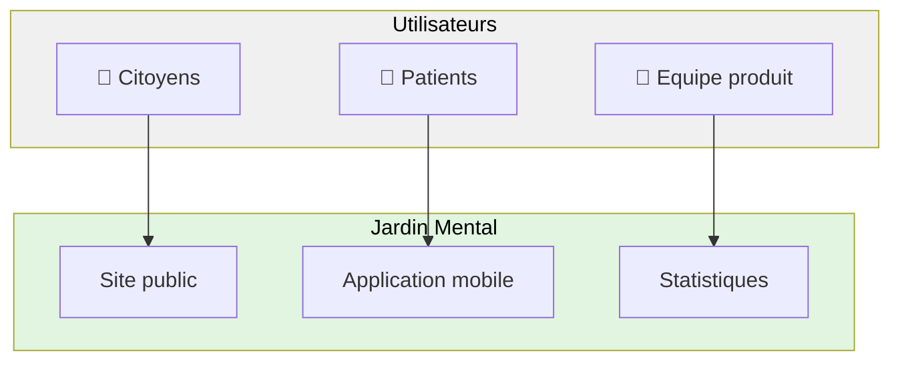
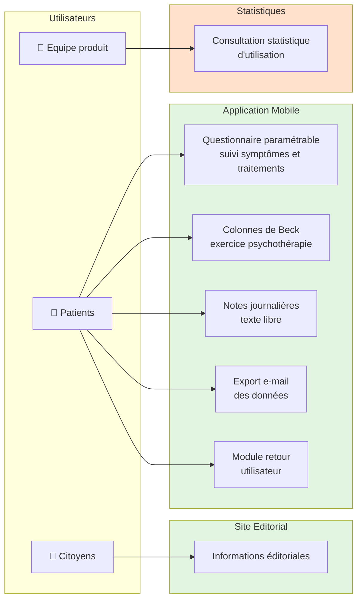
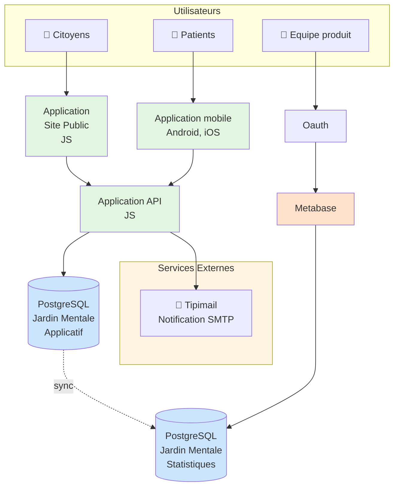
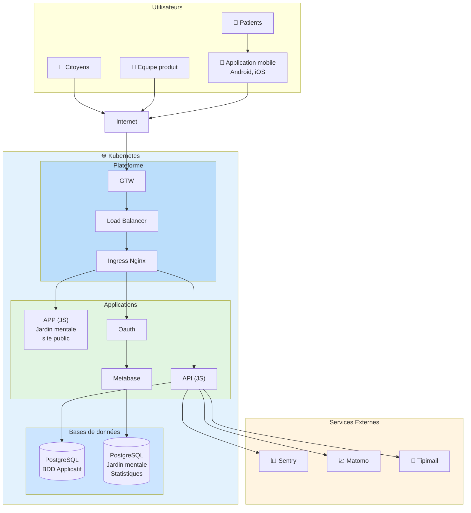

# Jardin Mental - Dossier d'Architecture

## 1. PROJET - ACTEURS

### Nom du projet applicatif

**Jardin Mental**

### Contexte projet applicatif

Les troubles psychiatriques touchent plus de 20 % de la population, à un moment de la vie. Et trouver le bon traitement peut prendre plusieurs années. Pendant ce temps-là, les symptômes évoluent, peuvent devenir chroniques et l'état du patient s'aggrave. L'impact peut être dramatique.

### Objectifs projet applicatif

Le médecin choisit ou modifie un traitement en se basant sur ce que lui rapporte la personne durant la consultation. Mais le médecin n'a que peu de temps avec la personne concernée et les informations rapportées ne sont pas fiables.

Les jeunes que nous avons interrogés rapportent en effet avoir du mal à dire tout ce qu'ils souhaitent en consultation et expliquent repartir en ayant bien souvent omis de transmettre une ou plusieurs informations importantes.

C'est qu'il est très difficile de donner une représentation fiable de ses symptômes et de l'évolution de ceux-ci.

**Pourquoi ?** Car aucun humain n'est capable de se souvenir fidèlement de l'évolution de son état psychique sur une durée trop longue.

Il est par exemple quasiment impossible de se rappeler la qualité de son sommeil 3 semaines auparavant, d'être suffisamment précis sur le nombre de crise d'angoisse survenues le mois dernier, l'intensité de celles-ci et leur impact sur notre quotidien, ou encore de se rappeler de ces jours où ça allait vraiment bien, alors que les jours précédant le rendez-vous, la tristesse nous a envahit...

### Enjeux projet applicatif

Plus les informations concernant mes symptômes sont proches de la réalité, de ce que je vis, plus mon médecin sera en mesure de me prescrire le bon traitement, celui qui sera le plus efficace possible avec le moins d'effets indésirables.

**Jardin Mental, c'est une aide pour un dialogue continu, qui s'adresse à tous, co-construite avec les usagers, comprenant :**

- La possibilité de sélectionner les symptômes et les effets indésirables des traitements médicaux à suivre
- Un rappel quotidien pour m'aider à y penser
- Des écrans simples permettant une saisie rapide
- Une synthèse de l'évolution de l'intensité des symptômes au cours du temps
- Un accès à des données informatives concernant les symptômes suivis
- Un parcours motivationnel dans la participation à mon suivi

Jardin Mental, c'est permettre aux personnes suivies de rester au plus près de leur expérience et d'en rendre compte le plus fidèlement possible au médecin, pour lui permettre de participer à soulager la souffrance grâce à une intervention médicamenteuse adéquate, personnalisée et rapide.

### Planning projet

| Version | Date | Description |
| ------- | ---- | ----------- |
| —       | —    | —           |

### Acteurs Projet

| Rôle                   | Nom               | Entité             |
| ---------------------- | ----------------- | ------------------ |
| Intrapreneur           | —                 | —                  |
| Chargé de portefeuille | REZGUI Lycia      | Fabrique Numérique |
| Product Manager        |                   |                    |
| Partie prenante        | —                 | —                  |
| Designer UX/UI         |                   | —                  |
| Développeur            |                   |                    |
| Développeur            | —                 | —                  |
| Développeur            | —                 | —                  |
| Equipe plateforme      | VAN-WOERKENS Gary | Fabrique Numérique |
| Equipe plateforme      | RENQUIN Igor      | Fabrique Numérique |

### Acteurs métiers du SI applicatif

Identifier les profils d'utilisateurs de l'applicatif, leur provenance et leur nombre

| Profils utilisateurs    | MCAS | RIE, intermin | Externe | Public |
| ----------------------- | ---- | ------------- | ------- | ------ |
| Equipe Produit          | —    | —             | X       | —      |
| Citoyens                | —    | —             | —       | X      |
| Patients                | —    | —             | —       | X      |
| Professionnels de santé | —    | —             | —       | —      |

---

## 2. FONCTIONNALITES – DONNEES

### Fonctionnalités du SI Applicatif

#### Fonctionnalités du SI Applicatif - Site éditorial

| Fonctionnalités          | MCAS | RIE, intermin | Externe | Public |
| ------------------------ | ---- | ------------- | ------- | ------ |
| Informations éditoriales | —    | —             | —       | X      |

#### Fonctionnalités du SI Applicatif - Statistiques

| Fonctionnalités                                                                                                                              | MCAS | RIE, intermin | Externe | Public |
| -------------------------------------------------------------------------------------------------------------------------------------------- | ---- | ------------- | ------- | ------ |
| Analyse de la donnée d'usage de l'application par l'utilisateur (du parcours utilisateur dans l'application, nb connexion, type de terminal) | —    | —             | X       | —      |

#### Fonctionnalités du SI Applicatif - Application Mobile

| Fonctionnalités                                                                                                                               | MCAS | RIE, intermin | Externe | Public |
| --------------------------------------------------------------------------------------------------------------------------------------------- | ---- | ------------- | ------- | ------ |
| Un questionnaire entièrement paramétrable permettant aux usagers de suivre l'ensemble des critères de leurs choix ainsi que leurs traitements | —    | —             | —       | X      |
| Les colonnes de beck : un exercice de psychothérapie                                                                                          | —    | —             | —       | X      |
| Les analyses : un ensemble de vue permettant d'avoir une analyse des données renseignées                                                      | —    | —             | —       | X      |
| Des notes : permettant à l'usagers de renseigner des éléments pour une journée donnée sous forme de texte libre                               | —    | —             | —       | X      |
| L'export de données : sous forme d'e-mail vers un destinataire au choix                                                                       | —    | —             | —       | X      |
| Un module de retour utilisateur                                                                                                               | —    | —             | —       | X      |
| Se fixer et suivre des objectifs à réaliser                                                                                                   | —    | —             | —       | X      |
| Demande sur les consommations, addictions                                                                                                     | —    | —             | —       | X      |

### Données métier du SI Applicatif

| Données métier du SI Applicatif | MCAS | RIE, intermin | Externe | Public |
| ------------------------------- | ---- | ------------- | ------- | ------ |
| —                               | —    | —             | —       | —      |

### Référentiel de données hors SI Applicatif

| Fichiers métier du SI Applicatif | MCAS | RIE, intermin | Externe | Public |
| -------------------------------- | ---- | ------------- | ------- | ------ |
| —                                | —    | —             | —       | —      |

### Sensibilité des données dans le SI Applicatif

#### Sensibilité des données - Site éditoriale

| Type de données très sensible | Présence | Type de données Sensible | Présence | Type de données Public    | Présence |
| ----------------------------- | -------- | ------------------------ | -------- | ------------------------- | -------- |
| NIR                           | —        | Architecture technique   | —        | Editoriaux                | X        |
| Médicales                     | —        | Organisationnel          | —        | Publication extranet      | —        |
| Vie Privée                    | —        | Etat civil               | —        | Campagne de communication | —        |
| Justice                       | —        | Adresse postale          | —        | Statistiques publiables   | X        |
| Identité                      | —        | Vie personnelle          | —        |                           |          |
| Biométrique                   | —        | Vie professionnelle      | —        |                           |          |
| Mécanisme de fraude           | —        | Mouvements salariaux     | —        |                           |          |
| Architecture Sécurisé         | —        | Santé économique         | —        |                           |          |
| Failles & Vulnérabilité       | —        |                          |          |                           |          |
| Patrimoine                    | —        |                          |          |                           |          |
| Appartenance syndicale        | —        |                          |          |                           |          |

#### Sensibilité des données - Statistiques

| Type de données très sensible | Présence | Type de données Sensible | Présence | Type de données Public    | Présence |
| ----------------------------- | -------- | ------------------------ | -------- | ------------------------- | -------- |
| NIR                           | —        | Architecture technique   | —        | Editoriaux                | —        |
| Médicales                     | —        | Organisationnel          | —        | Publication extranet      | —        |
| Vie Privée                    | —        | Etat civil               | —        | Campagne de communication | —        |
| Justice                       | —        | Adresse postale          | —        | Statistiques publiables   | —        |
| Identité                      | —        | Vie personnelle          | —        |                           |          |
| Biométrique                   | —        | Vie professionnelle      | —        |                           |          |
| Mécanisme de fraude           | —        | Mouvements salariaux     | —        |                           |          |
| Architecture Sécurisé         | —        | Santé économique         | —        |                           |          |
| Failles & Vulnérabilité       | —        |                          |          |                           |          |
| Patrimoine                    | —        |                          |          |                           |          |
| Appartenance syndicale        | —        |                          |          |                           |          |

#### Sensibilité des données - Application mobile

| Type de données très sensible | Présence | Type de données Sensible | Présence | Type de données Public    | Présence |
| ----------------------------- | -------- | ------------------------ | -------- | ------------------------- | -------- |
| NIR                           | —        | Architecture technique   | —        | Editoriaux                | —        |
| **Médicales**                 | **X**    | Organisationnel          | —        | Publication extranet      | —        |
| **Vie Privée**                | **X**    | Etat civil               | —        | Campagne de communication | —        |
| Justice                       | —        | Adresse postale          | —        | Statistiques publiables   | —        |
| Identité                      | —        | Vie personnelle          | —        |                           |          |
| Biométrique                   | —        | Vie professionnelle      | —        |                           |          |
| Mécanisme de fraude           | —        | Mouvements salariaux     | —        |                           |          |
| Architecture Sécurisé         | —        | Santé économique         | —        |                           |          |
| Failles & Vulnérabilité       | —        |                          |          |                           |          |
| Patrimoine                    | —        |                          |          |                           |          |
| Appartenance syndicale        | —        |                          |          |                           |          |

### Services utilisés par l'application

| Services utilisés par l'application | Mode d'échange | MCAS | RIE, intermin | Externe | Public |
| ----------------------------------- | -------------- | ---- | ------------- | ------- | ------ |
| TIPIMAIL                            | SMTP           | —    | —             | X       | —      |

---

## 3. CONTRAINTES – VOLUMETRIE

### Contraintes légales

À compléter

### Contraintes métiers

À compléter

### Normes et règles à respecter

| Norme    | Description                                             |
| -------- | ------------------------------------------------------- |
| **RGPD** | Règlement Général sur la Protection des Données         |
| **RGAA** | Référentiel Général d'Accessibilité des Administrations |
| **RGS**  | Référentiel Général de Sécurité                         |
| **RGI**  | Référentiel Général d'Interopérabilité                  |

### Dépendances avec d'autres SI

| Nom du SI Applicatif | Fournisseur | Consommateur |
| -------------------- | ----------- | ------------ |
| —                    | —           | —            |

### Dépendances avec le poste de travail

| Dépendance avec le terminal utilisateur | Composant    |
| --------------------------------------- | ------------ |
| O.S.                                    | Android, iOS |
| Navigateur                              | —            |
| Suite bureautique                       | —            |
| Plugin, Addin                           | —            |
| Périphérique                            | —            |

### Volumétrie données du SI Applicatif

| ID  | Description                                   | Valeur |
| --- | --------------------------------------------- | ------ |
| D1  | Nombre d'enregistrements à récupérer          | —      |
| D2  | Nombre enregistrements par an                 | —      |
| D3  | Taille moyenne enregistrement (Ko)            | —      |
| D4  | Nombre d'années enregistrements en base (BDD) | —      |
| D5  | Volume BDD initial (Go) = (D1 x D3) / 1024²   | —      |
| D6  | Volume BDD Annuel (Go) = (D2 x D3) / 1024²    | —      |
| D7  | Volume BDD Total (Go) = (D4 x D6) + D5        | —      |

### Volumétrie fichiers du SI Applicatif

| ID  | Description                                  | Valeur |
| --- | -------------------------------------------- | ------ |
| F1  | Nombre de fichiers à récupérer               | —      |
| F2  | Nombre de fichiers par an                    | —      |
| F3  | Taille moyenne des fichiers (Mo)             | —      |
| F4  | Nombre d'années fichiers en File System (FS) | —      |
| F5  | Volume FS initial (Go) = (F1 x F3) / 1024²   | —      |
| F6  | Volume Annuel (Go) = (F2 x F3) / 1024²       | —      |
| F7  | Volume FS Total (Go) = (F4 x F6) + F5        | —      |

### Réduction volume de données

- Purge de données dans BDD Applicatif
- Purge fichier dans FS Applicatif
- Archivage données hors Applicatif
- Archivage fichiers hors Applicatif

---

## 4. EXIGENCES NON FONCTIONNELLES

### Exigences sur les données

| Exigence                    | Objectif, Score visé | Moyens à mettre en œuvre                                |
| --------------------------- | -------------------- | ------------------------------------------------------- |
| Exigence de Disponibilité   | —                    | —                                                       |
| Exigence d'Intégrité        | —                    | Contrôles d'intégrité sur les données sensibles         |
| Exigence de Confidentialité | —                    | Données médicales et privées protégées, accès restreint |
| Exigence de Traçabilité     | —                    | Monitoring via Sentry, logs applicatifs                 |

| Information                            | Valeur       |
| -------------------------------------- | ------------ |
| Liens vers étude AIPD                  | —            |
| Lins vers analyse de Risque (EBIOS RM) | —            |
| AQSSI                                  | À renseigner |
| Responsable de traitement              | À renseigner |
| Homologué RGS                          | À renseigner |
| Date d'homologation                    | À renseigner |
| Durée d'homologation                   | À renseigner |
| Lien vers le dossier d'homologation    | À renseigner |

### Période de service, Garantie de service, Performance

#### Site Jardin mental site éditorial

**Période de service**

| Période  | Date début | Date fin | NBC | NBS |
| -------- | ---------- | -------- | --- | --- |
| Standard | Lundi      | dimanche | —   | —   |
| Critique | —          | —        | —   | —   |
| Charge   | —          | —        | —   | —   |

Description de la charge : —

**Garantie de service**

| Application métier                       | Application | Standard |
| ---------------------------------------- | ----------- | -------- |
| Plage de Services Infogérance            | —           | —        |
| Perte de Données maximale Admissible     | 48h         | —        |
| Durée Maximale d'Interruption Admissible | 48h         | —        |

| Impact                                         | Description                                                                                                                       |
| ---------------------------------------------- | --------------------------------------------------------------------------------------------------------------------------------- |
| Impact Métier en cas de perte de données       | **Faible :** les stores applicatifs (google et apple) publient les mêmes info que le site éditorial                               |
| Impact Métier en cas de défaillance du service | **Faible :** Perte de visibilité sur l'accès à l'application mobile et les informations générales proposées par le site éditorial |

**Performance**

| Temps de réponse            | Période Standard | Période de charge |
| --------------------------- | ---------------- | ----------------- |
| Affichage Page d'accueil    | —                | —                 |
| Affichage page simple       | —                | —                 |
| Affichage page complexe     | —                | —                 |
| Traitement requête simple   | —                | —                 |
| Traitement requête complexe | —                | —                 |

**Exploitabilité**

| Batch applicatif | Plage d'exécution | Fréquence | Impact métier | Impact charge |
| ---------------- | ----------------- | --------- | ------------- | ------------- |
| N/A              | —                 | —         | N/A           | N/A           |

#### Site Jardin mental Applicatif

**Période de service**

| Période  | Date début | Date fin | NBC | NBS |
| -------- | ---------- | -------- | --- | --- |
| Standard | —          | —        | —   | —   |
| Critique | —          | —        | —   | —   |
| Charge   | —          | —        | —   | —   |

Description de la charge : —

**Garantie de service**

| Application métier                       | Application | Standard |
| ---------------------------------------- | ----------- | -------- |
| Plage de Services Infogérance            | —           | —        |
| Perte de Données maximale Admissible     | —           | —        |
| Durée Maximale d'Interruption Admissible | —           | —        |

| Impact                                         | Description |
| ---------------------------------------------- | ----------- |
| Impact Métier en cas de perte de données       | —           |
| Impact Métier en cas de défaillance du service | —           |

**Performance**

| Temps de réponse            | Période Standard | Période de charge |
| --------------------------- | ---------------- | ----------------- |
| Affichage Page d'accueil    | —                | —                 |
| Affichage page simple       | —                | —                 |
| Affichage page complexe     | —                | —                 |
| Traitement requête simple   | —                | —                 |
| Traitement requête complexe | —                | —                 |

**Exploitabilité**

| Batch applicatif | Plage d'exécution | Fréquence | Impact métier | Impact charge |
| ---------------- | ----------------- | --------- | ------------- | ------------- |
| —                | —                 | —         | —             | —             |

#### Site Jardin mental Statistiques

**Période de service**

| Période  | Date début | Date fin | NBC | NBS |
| -------- | ---------- | -------- | --- | --- |
| Standard | Lundi      | Vendredi | 5   | —   |
| Critique | —          | —        | —   | —   |
| Charge   | —          | —        | —   | —   |

Description de la charge : —

**Garantie de service**

| Application métier                       | Application | Standard |
| ---------------------------------------- | ----------- | -------- |
| Plage de Services Infogérance            | —           | —        |
| Perte de Données maximale Admissible     | 48h         | —        |
| Durée Maximale d'Interruption Admissible | 48h         | —        |

| Impact                                         | Description                                                                  |
| ---------------------------------------------- | ---------------------------------------------------------------------------- |
| Impact Métier en cas de perte de données       | **Faible :** Les statistiques d'usages se calculent sur des périodes longues |
| Impact Métier en cas de défaillance du service | **Faible :** Les statistiques d'usages se calculent sur des périodes longues |

**Performance**

| Temps de réponse            | Période Standard | Période de charge |
| --------------------------- | ---------------- | ----------------- |
| Affichage Page d'accueil    | —                | —                 |
| Affichage page simple       | —                | —                 |
| Affichage page complexe     | —                | —                 |
| Traitement requête simple   | —                | —                 |
| Traitement requête complexe | —                | —                 |

**Exploitabilité**

| Batch applicatif | Plage d'exécution | Fréquence | Impact métier | Impact charge |
| ---------------- | ----------------- | --------- | ------------- | ------------- |
| —                | —                 | —         | —             | —             |

---

## 5. ARCHITECTURE ACTEURS ET PROCESSUS

```
                  ┌─────────────┐              ┌─────────────┐
                  │   Citoyens  │              │   Patients  │
                  │     👥      │              │     👥      │
                  └──────┬──────┘              └──────┬──────┘
                         │                            │
                         └────────────┬───────────────┘
                                      │
                 ┌────────────────────┴────────────────────────┐
                 │          Jardin Mental                      │
                 │                                             │
                 │  ┌──────────────┐    ┌──────────────┐      │
                 │  │              │    │              │      │
                 │  │ Site public  │    │ Application  │      │
                 │  │              │    │   mobile     │      │
                 │  └──────────────┘    └──────────────┘      │
                 │                                             │
                 │                      ┌──────────────┐      │
                 │                      │              │      │
                 │                      │ Statistiques │◄─────┼──── 👥 Equipe produit
                 │                      │              │      │
                 │                      └──────────────┘      │
                 │                                             │
                 └─────────────────────────────────────────────┘
```

**Version Mermaid :**



---

## 6. ARCHITECTURE FONCTIONNELLE

```
                     👥                                  👥
                  Patients                            Citoyens
                     │                                    │
                     ▼                                    ▼
        ┌────────────────────────────┐     ┌────────────────────────────┐
        │   Application Mobile       │     │  Jardin Mental - Site      │
        │                            │     │      Editorial             │
        ├────────────────────────────┤     ├────────────────────────────┤
        │ Un questionnaire entière-  │     │                            │
        │ ment paramétrable permet-  │     │  Informations éditoriales  │
        │ tant aux usagers de suivre │     │                            │
        │ l'ensemble des critères de │     └────────────────────────────┘
        │ leurs choix ainsi que      │                  │
        │ leurs traitements          │                  │
        ├────────────────────────────┤                  │
        │ Les colonnes de beck :     │                  ▼
        │ un exercice de thérapie    │     ┌────────────────────────────┐
        │ psychothérapie             │     │      Statistiques          │
        ├────────────────────────────┤     │                            │
        │ Des notes : permettant à   │     │  Consultation statistique  │
        │ l'usagers de renseigner    │     │  d'utilisation de          │
        │ des éléments pour une      │     │  l'application             │
        │ journée donnée sous forme  │     │                            │
        │ de texte libre             │     └─────────────┬──────────────┘
        ├────────────────────────────┤                   │
        │ Envoi par e-mail des       │                   │
        │ données renseignées vers   │                   ▼
        │ un destinataire             │              👥
        ├────────────────────────────┤           Equipe produit
        │ Un module de retour        │
        │ utilisateur                │
        └────────────────────────────┘
```

**Version Mermaid :**



---

## 7. ARCHITECTURE APPLICATIVE

```
          👥                            👥                      👥
       Citoyens                     Patients              Equipe produit
          │                            │                        │
          │                            │                        │
          ▼                            ▼                        ▼
   ┌─────────────┐            ┌─────────────────┐      ┌─────────────┐
   │             │            │  Application    │      │             │
   │ Application │            │    mobile       │      │    Oauth    │
   │             │            │  Android, iOS   │      │             │
   │   (JS)      │            │                 │      └──────┬──────┘
   │             │            └────────┬────────┘             │
   └──────┬──────┘                     │                      │
          │                            │                      │
          │      ┌─────────────────────┼──────────────────────┘
          │      │                     │
          │      │                     ▼
          │      │            ┌──────────────────┐
          │      │            │  Application API │
          │      │            │                  │
          │      │            │       (JS)       │
          │      │            │                  │
          │      │            └────────┬─────────┘
          │      │                     │
          │      │                     │
          │      │                     ▼
          │      │            ┌──────────────────┐
          │      │            │  PostgreSQL      │
  ┌───────▼──────▼─────┐      │                  │      ┌─────────────┐
  │                    │      │  Jardin Mentale  │      │             │
  │ Notification SMTP  │◄─────┤  - Applicatif    │─────►│  Metabase   │
  │   (Tipimail)       │      │                  │      │             │
  └────────────────────┘      └────────┬─────────┘      └──────▲──────┘
                                       │                        │
                                       │                        │
                                       ▼                        │
                              ┌──────────────────┐              │
                              │   PostgreSQL     │              │
                              │                  │              │
                              │  Jardin Mentale  ├──────────────┘
                              │  - Statistiques  │
                              │                  │
                              └──────────────────┘
```

**Version Mermaid :**



---

## 8. ARCHITECTURE TECHNIQUE

```
                      📱
                 Application mobile
                  Android, iOS          ───────────────►  📊 Sentry
                       │
      👥          👥   │       👥
   Citoyens   Patients │   Equipe produit              ──►  📈 Matomo
       │          │    │       │
       └──────────┼────┴───────┘
                  │                                     ──►  📧 Tipimail
                  │
                  ▼
         ┌────────────────┐
         │   Internet     │
         └────────┬───────┘
                  │
    ┌─────────────┴────────────────────────────────────────────────┐
    │  ☸                                                            │
    │  Kubernetes                                                   │
    │  ┌────────────────────────────────────────────────────────┐  │
    │  │  Plateforme                                            │  │
    │  │                                                         │  │
    │  │   ┌──────┐      ┌────┐      ┌──────────────┐          │  │
    │  │   │ GTW  │─────►│ LB │─────►│ Ingress Nginx│          │  │
    │  │   └──────┘      └────┘      └──────┬───────┘          │  │
    │  │                                     │                  │  │
    │  └─────────────────────────────────────┼──────────────────┘  │
    │                                        │                     │
    │   ┌────────────────────────────────────┼──────────────────┐  │
    │   │                                    ▼                  │  │
    │   │  ┌──────────┐   ┌──────────┐   ┌──────────┐         │  │
    │   │  │          │   │          │   │          │         │  │
    │   │  │   APP    │   │   API    │   │  Oauth   │         │  │
    │   │  │   (JS)   │   │   (JS)   │   │          │         │  │
    │   │  │          │   │          │   └────┬─────┘         │  │
    │   │  │          │   └────┬─────┘        │               │  │
    │   │  │Jardin    │        │              │               │  │
    │   │  │mentale   │        │              ▼               │  │
    │   │  │site      │        │       ┌──────────────┐       │  │
    │   │  │public    │        │       │              │       │  │
    │   │  │          │        │       │   Metabase   │       │  │
    │   │  └──────────┘        │       │              │       │  │
    │   │                      │       └──────┬───────┘       │  │
    │   │                      ▼              │               │  │
    │   │              ┌────────────┐         │               │  │
    │   │              │            │         │               │  │
    │   │              │  BDD       │◄────────┘               │  │
    │   │              │ PostgreSQL │                         │  │
    │   │              │            │                         │  │
    │   │              │Jardin      │                         │  │
    │   │              │mentale     │                         │  │
    │   │              │Statistiques│                         │  │
    │   │              └────────────┘                         │  │
    │   │                                                     │  │
    │   └─────────────────────────────────────────────────────┘  │
    │                                                             │
    └─────────────────────────────────────────────────────────────┘
```

**Légende des flux :**

1. APP (Site public)
2. API accès
3. API ↔ BDD
4. Oauth Proxy accès
5. Oauth ↔ Metabase
6. Metabase ↔ BDD
7. API → Tipimail (SMTP)
8. API → Matomo

**Version Mermaid :**



---

## 9. ARCHITECTURE DE DONNEES

### Modèle de données principal

La base de données PostgreSQL utilise Prisma ORM avec les modèles principaux suivants :

#### AnonymisedUser

- Utilisateur anonymisé
- Identifié par un UUID
- Token de notification unique

#### Reminder

- Rappel associé à un utilisateur
- Types : Main, Goal, Inactivity
- Gestion fine des jours et heures

#### ReminderUtcDaysOfWeek

- Détail des jours de la semaine pour chaque rappel
- Booléens pour chaque jour

**Relations :**

- Un utilisateur possède plusieurs rappels
- Chaque rappel peut avoir une configuration de jours spécifique

**Index :**

- Index sur les tokens
- Index sur les types
- Index sur les heures (pour optimiser les requêtes de rappels)

---

## 10. SERVEURS, COMPOSANTS APPLICATIFS

### [Site éditorial - APP]

| Attribut         | Valeur    |
| ---------------- | --------- |
| **Rôle**         | APP       |
| **Type**         | Conteneur |
| **CPU Requests** | 100m cpu  |
| **CPU Limits**   | 200m cpu  |
| **RAM Requests** | 256 Mo    |
| **RAM Limits**   | 384 Mo    |
| **HPA Status**   | OFF       |
| **HPA min**      | 2         |
| **HPA max**      | 2         |

**Composants :**

| Catégorie | Composant | Version | Rôle |
| --------- | --------- | ------- | ---- |
| APP       | NodeJS    | —       | —    |

### [Jardin Mentale - Base de données]

| Attribut         | Valeur          |
| ---------------- | --------------- |
| **Rôle**         | Base de données |
| **Type**         | Conteneur       |
| **CPU Requests** | 100m cpu        |
| **CPU Limits**   | 1 cpu           |
| **RAM Requests** | 1 Go            |
| **RAM Limits**   | 1 Go            |
| **HPA Status**   | OFF             |
| **HPA min**      | 3               |
| **HPA max**      | 3               |

**Composants :**

| Catégorie | Composant  | Version | Rôle |
| --------- | ---------- | ------- | ---- |
| CNPG      | PostgreSQL | 15      | —    |

### [Jardin mentale - APP]

| Attribut         | Valeur    |
| ---------------- | --------- |
| **Rôle**         | APP       |
| **Type**         | Conteneur |
| **CPU Requests** | 100m cpu  |
| **CPU Limits**   | 200m cpu  |
| **RAM Requests** | 512 Mo    |
| **RAM Limits**   | 768 Mo    |
| **HPA Status**   | OFF       |
| **HPA min**      | 2         |
| **HPA max**      | 2         |

**Composants :**

| Catégorie | Composant | Version | Rôle |
| --------- | --------- | ------- | ---- |
| APP       | NodeJS    | 20      | —    |

### [Jardin mentale - statistiques - Metabase]

| Attribut       | Valeur      |
| -------------- | ----------- |
| **Rôle**       | Statistique |
| **Type**       | Conteneur   |
| **HPA Status** | OFF         |
| **HPA min**    | 1           |
| **HPA max**    | 1           |

**Composants :**

| Catégorie   | Composant | Version | Rôle |
| ----------- | --------- | ------- | ---- |
| Statistique | Metabase  | —       | —    |

### [Jardin mentale - Oauth]

| Attribut       | Valeur           |
| -------------- | ---------------- |
| **Rôle**       | Authentification |
| **Type**       | conteneur        |
| **HPA Status** | OFF              |
| **HPA min**    | 1                |
| **HPA max**    | 1                |

**Composants :**

| Catégorie | Composant   | Version | Rôle |
| --------- | ----------- | ------- | ---- |
| APP       | oauth proxy | —       | —    |

### [Jardin mentale - statistiques - BDD]

| Attribut         | Valeur          |
| ---------------- | --------------- |
| **Rôle**         | Base de données |
| **Type**         | Conteneur       |
| **CPU Requests** | 256m cpu        |
| **CPU Limits**   | 512m cpu        |
| **RAM Requests** | 1 Go            |
| **RAM Limits**   | 1 Go            |
| **HPA Status**   | OFF             |
| **HPA min**      | 3               |
| **HPA max**      | 3               |

**Composants :**

| Catégorie | Composant  | Version | Rôle |
| --------- | ---------- | ------- | ---- |
| CNPG      | PostgreSQL | 15      | —    |

### [Jardin mentale - statistiques - BSS Sync]

| Attribut         | Valeur                          |
| ---------------- | ------------------------------- |
| **Rôle**         | Base de données Synchronisation |
| **Type**         | Conteneur                       |
| **CPU Requests** | 100m cpu                        |
| **CPU Limits**   | 4 cpu                           |
| **RAM Requests** | 1 Go                            |
| **RAM Limits**   | 1Go                             |
| **HPA Status**   | OFF                             |
| **HPA min**      | 1                               |
| **HPA max**      | 1                               |

**Composants :**

| Catégorie | Composant  | Version | Rôle |
| --------- | ---------- | ------- | ---- |
| CNPG      | PostgreSQL | 15      | —    |

---

## 11. MATRICES DES FLUX APPLICATIVE ET SYSTEME

### Matrice de flux Applicatif - Site Editorial

| N° Flux | Source | Destination        | Port | Protocole | Commentaires |
| ------- | ------ | ------------------ | ---- | --------- | ------------ |
| 1       | 1P     | Site Jardin mental | 443  | HTTPS     | —            |

### Matrice de flux Applicatif - Jardin Mental

| N° Flux | Source | Destination | Port | Protocole | Commentaires |
| ------- | ------ | ----------- | ---- | --------- | ------------ |
| 11      | 1P     | API         | 443  | HTTPS     | —            |
| 12      | API    | BDD         | 5432 | PG        | —            |
| 16      | API    | TIPIMAIL    | 587  | SMTP      | —            |
| 17      | API    | SENTRY      | 443  | HTTPS     | —            |

### Matrice de flux Applicatif - Statistiques

| N° Flux | Source      | Destination | Port | Protocole | Commentaires |
| ------- | ----------- | ----------- | ---- | --------- | ------------ |
| 13      | 1P          | oauth proxy | 443  | HTTPS     | —            |
| 14      | oauth proxy | metabase    | 443  | HTTPD     | —            |
| 15      | metabase    | BDD         | 5432 | PG        | —            |

### Matrice de flux plateforme

| N° Flux | Source        | Destination   | Port     | Protocole    | Commentaires |
| ------- | ------------- | ------------- | -------- | ------------ | ------------ |
| 1P      | Internet      | Firewall      | 80 - 443 | HTTP - HTTPS | —            |
| 1P      | Firewall      | Load Balancer | 80 - 443 | HTTP - HTTPS | —            |
| 1P      | Load Balancer | Ingress NGINX | 80 - 443 | HTTP - HTTPS | —            |

---

## URLS ET CERTIFICATS

### URLs Site Jardin Mental

| Attribut                     | Valeur                                       |
| ---------------------------- | -------------------------------------------- |
| **URL**                      | https://jardinmental.fabrique.social.gouv.fr |
| **Equipement portant l'URL** | —                                            |
| **Usage**                    | —                                            |
| **SSL**                      | Oui                                          |
| **Type certificat**          | —                                            |
| **VIP**                      | —                                            |
| **LB / RP**                  | Oui                                          |
| **Terminaison SSL**          | —                                            |

---

## INFORMATIONS TECHNIQUES COMPLÉMENTAIRES

### Technologies Frontend (Mobile)

- **Framework** : React Native avec Expo
- **Gestionnaire de paquets** : pnpm
- **Plateforme** : iOS et Android
- **Analytics** : Matomo (via logEvents.js)
- **Tests** : Suite de tests automatisés avec couverture
- **Publication** : Builds locaux, publication manuelle sur App Store et Play Store

### Technologies Backend (API)

- **Runtime** : Node.js
- **Framework** : Express
- **Langage** : TypeScript (migration progressive depuis JavaScript)
- **ORM** : Prisma
- **Base de données** : PostgreSQL 15
- **Monitoring** : Sentry
- **Tests** : Scripts de test automatisés, type-check

### Fonctionnalités Backend

- Endpoints REST pour la gestion des utilisateurs, rappels, notifications
- Cron jobs pour l'envoi de rappels et tâches récurrentes
- Middlewares pour :
  - Gestion des erreurs
  - Rate limiting
  - Vérification de version
  - Sécurité

### Sécurité et Conformité

- **Anonymisation** : Aucun identifiant personnel stocké, UUID uniquement
- **Tokens de notification** : Stockés de façon unique et indexés
- **Validation** : Typage strict, validation des entrées
- **Monitoring** : Sentry pour le suivi des erreurs
- **Conformité** : RGPD, RGS, RGI, RGAA

### Déploiement

- **Mobile** : Publication via Expo, builds locaux
- **API** : Déploiement via Docker sur Kubernetes
- **CI/CD** : Tests automatisés, vérification de type, couverture
- **Environnements** : Configuration via fichiers d'environnement

---

## LIENS UTILES ET DOCUMENTATION

- [Site officiel](https://jardinmental.fabrique.social.gouv.fr/)
- [Documentation mobile](app/README.md)
- [Documentation API TypeScript](api/README-TypeScript.md)
- [Intentions du projet](https://beta.gouv.fr/startups/monsuivipsy.html)

---

**Document mis à jour le :** 2026-01-30
